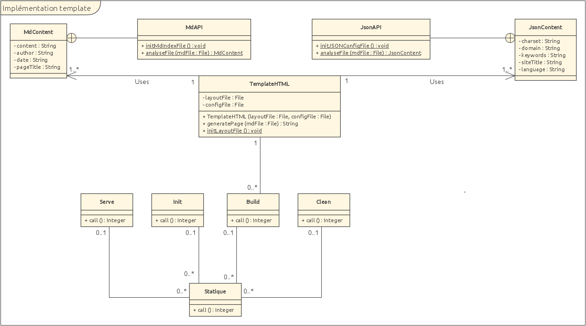
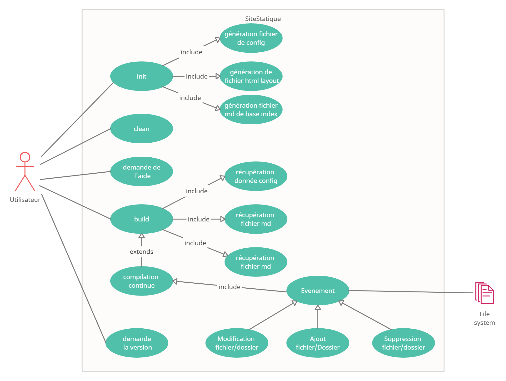

# Rapport du groupe <!-- omit in toc -->
Par Axel Vallon, Jade Gröli, David González León

Ce rapport montre l'évolution du projet de site statique développé par notre groupe.

- [1. Rapport Phase 1](#1-rapport-phase-1)
- [2. Sprint 1](#2-sprint-1)
  - [2.1. Introduction](#21-introduction)
  - [2.2. Planification](#22-planification)
  - [2.3. Test](#23-test)
    - [2.3.1. Junit](#231-junit)
    - [2.3.2. Intégration continue](#232-intégration-continue)
  - [2.4. Description des commandes](#24-description-des-commandes)
    - [2.4.1. Statique](#241-statique)
    - [2.4.2. Init](#242-init)
    - [2.4.3. Build](#243-build)
      - [2.4.3.1. MdAPI](#2431-mdapi)
      - [2.4.3.2. JsonAPI](#2432-jsonapi)
    - [2.4.4. Clean](#244-clean)
  - [2.5. Documentation](#25-documentation)
  - [2.6. Conclusion](#26-conclusion)
- [3. Sprint 2](#3-sprint-2)
  - [3.1. Introduction](#31-introduction)
  - [3.2. Planification](#32-planification)
  - [3.3. Modélisation](#33-modélisation)
    - [3.3.1. Diagramme d'état](#331-diagramme-détat)
    - [3.3.2. Diagramme de séquence](#332-diagramme-de-séquence)
  - [3.4. Utilisation template](#34-utilisation-template)
  - [3.5. Refactoring](#35-refactoring)
    - [3.5.1. Lecture fichiers markdown](#351-lecture-fichiers-markdown)
    - [3.5.2. Lecture configuration](#352-lecture-configuration)
    - [3.5.3. Refonte de Build](#353-refonte-de-build)
  - [3.6. Commande Serve](#36-commande-serve)
  - [3.7. Automatisation du processus de release](#37-automatisation-du-processus-de-release)
  - [3.8. Conclusion Sprint](#38-conclusion-sprint)
- [4. Sprint 3](#4-sprint-3)
  - [4.1. Introduction](#41-introduction)
  - [4.2. Planification](#42-planification)
    - [4.2.1. Discussion des deltas](#421-discussion-des-deltas)
  - [4.3. Compilation continu](#43-compilation-continu)
    - [4.3.1. Conception](#431-conception)
    - [4.3.2. Répartition](#432-répartition)
    - [4.3.3. Décisions d'implémentation](#433-décisions-dimplémentation)
    - [4.3.4. Problèmes rencontrés](#434-problèmes-rencontrés)
  - [4.4. Code quality](#44-code-quality)
  - [4.5. Code coverage](#45-code-coverage)
  - [4.6. Code Benchmarking](#46-code-benchmarking)
  - [4.7. Javadoc et manuel utilisateur](#47-javadoc-et-manuel-utilisateur)
    - [4.7.1. Javadoc](#471-javadoc)
    - [4.7.2. Manuel utilisateur](#472-manuel-utilisateur)
  - [4.8. Refactoring et mise au propre](#48-refactoring-et-mise-au-propre)
  - [4.9. Conclusion](#49-conclusion)
- [5. Conclusion](#5-conclusion)

# 1. Rapport Phase 1

*Rédigez votre réflexion concernant le processus choisi (piloté ou agile) pour la réalisation du projet et documentez votre mode de collaboration.*

Nous avons choisi un processus de développement agile car certaines des étapes à effectuer dépendaient d'autres étapes (notamment les 4 commandes picocli). 

Nous avons tout d'abord créé des issues dans notre Kanban et nous les avons attribué aux différents membres du groupe. Ensuite, nous sommes allés effectuer chacun nos tâches respectives en créant des pull request pour chaque tâche effectuée. Etant donné que toutes les pull request devaient être approuvées par 2 personnes, tous les membres du groupes ont pu voir le travail effectué et vérifier celui des autres. Voici ci-dessous une description de nos réflexions autours des différents points demandés : 

* License : 
  Nous avons décidé de choisir une licence GPL-3.0, car c'était celle qui nous permettait de garder le plus grand contrôle sur notre code. Etant donné que notre repository est public, ça nous met à l'abris de potentiel plagiat.
* Code of conduct : 
  Nous avons utilisé le template de base de Github pour le Code of conduct. En effet, celui-ci intègre tout les points que nous trouvions essentiels pour une bonne collaboration.

-----------------------------------------------------------------------------

# 2. Sprint 1

## 2.1. Introduction

L'objectif de ce premier sprint sera de documenter une première expérience des pratiques agiles.
Il faudra convenir d'un workflow et formaliser les pratiques de développement au sein de l'équipe. Les différentes tâches doivent être subdivisées et réparties entre les membres de l'équipe puis les durées nécessaires pour les mener à bien doivent être estimées et relevées une fois le travail accompli. L'implémentation se fera en réutilisant au besoin des logiciels existants et des tests unitaires seront écrits avant d'implémenter chaque composant pour pouvoir assurer son bon fonctionnement. Les changements seront régulièrement committés et décrits au moyen de messages explicites. 

Le backlog produit est divisé en plusieurs stories. L'objectif est d'implémenter les premières commandes qui permettent à un utilisateur de créer un site statique. L'utilisateur doit pouvoir saisir des données structurées dans un format uniforme ainsi que du contenu dans un format simplifié tel que Markdown. Les pages créées contiennent des métadonnées et un certain contenu qui sera défini plus loin. Une de ces commandes doit permettre d'afficher la version du générateur de site statique. Une seconde commande initialisera le site tandis qu'une troisième pourra le compiler. Une dernière servira à nettoyer le site statique. Les pulls requests ne pourront être mergées seulement si la compilation et les tests ne génèrent pas d'erreurs.
Chaque étape sera documentée dans ce qui suit.

## 2.2. Planification

|                Stories                 |                                                                        Description                                                                        | Temps planifié | Temps passé | Personne en charge |
| :------------------------------------: | :-------------------------------------------------------------------------------------------------------------------------------------------------------: | :------------: | :---------: | :----------------: |
|     Saisie de données structurées      |                                      Permettre l'ajout d'une structure aux données du site à travers un fichier json                                      |       8h       |    8h30     |        Axel        |
|           Saisie du contenu            |                                                    Permettre la saisie de contenu du site en markdown                                                     |       5h       |     6h      |       David        |
|            Format des pages            |                              Permettre l'ajout de métadonnées dans le fichier markdown, et ajout dans le fichier html final                               |       2h       |    2h30     |        Tous        |
|        Affichage de la version         |                                            Permettre l'affichage de la version du générateur de site statique                                             |       2h       |     4h      |        Axel        |
|      Initialiser un site statique      |            Créer ou enrichir un dossier nommé par l'utilisateur contenant un fichier de configuration, un fichier index et une page d'accueil             |       1h       |     2h      |        Jade        |
|       Compiler un site statique        |            Création du dossier build et du fichier html correspondant a la page, généré a partir de fichiers fournis dans le directory courant            |       3h       |     3h      |       David        |
|       Nettoyer un site statique        |                               Permettre de nettoyer le dossier build et son contenu qui a été généré par la commande build                                |      1h30      |    1h30     |       David        |
| Amelioration de l'intégration continue |                                   Compléter les workflows existant et les garder a jours selon l'évolution du programme                                   |       4h       |     5h      |        Tous        |
|        Release et documentation        | Une release du générateur de site statique doit être téléchargeable sur GitHub et elle doit être accompagnée d'instructions d'installation reproductibles |       1h       |     1h      |        Tous        |
|    Ecriture du rapport (en continu)    |                                                                 Ecriture du rapport final                                                                 |      10h       |     12h     |        Tous        |

## 2.3. Test

Nous avons utilisé deux outils pour implémenter ces tests. Le premier, Junit, nous a permis de développer des tests pour vérifier le comportement des différentes fonctions de notre code. Le deuxième, l'intégration continue à travers github actions, nous a permis de nous assurer de la cohérence générale de notre application a chaque changement, tout en nous permettant de vérifier le comportement de nos commandes et options sur un environnement réel.

La description de notre processus de réflexion autour de ces deux outils est décrite ci dessous.

### 2.3.1. Junit

L'ensemble des tests des fonctions ont été réalisés avec l'aide de JUnit. Nous nous sommes tournés vers cette librairie offrant la possibilité d'implémenter des tests unitaires car cette dernière est la plus populaire parmi toutes les librairies de tests unitaires Java. Nous maîtrisons par ailleurs tous cette librairie, ce qui nous a permis à chacun d'implémenter différents tests. 

### 2.3.2. Intégration continue

Pour l'intégration continue nous avons choisi d'utiliser les outils offerts par Github Actions. Nous avons aussi considéré la possibilité d'utiliser Travis CI, un autre outil d'intégration continue qui nous a été brièvement présenté en cours de réseau, mais avons finalement préféré Github Actions car elles semblaient être plus facile d'utiliser pour des novices de l'intégration continue.

Nous avons d'abord mis une action qui effectue un mvn package sur notre projet. Ce workflow nous permet de nous assurer que nos tests passent tous et que le processus de packaging de l'application se passe sans souci.

Puis nous avons rajouté une action qui permet de vérifier que l'extraction de l'application et son lancement en ligne de commande marchait correctement. Nous vérifions originalement uniquement que statique, notre commande de base, se lançait correctement. Puis nous avons rajouté, au fur et à mesure de l'implémentation des autres commandes, des tests du lancement de celles ci. Nous avons aussi rajouté des vérifications des options que nous avons ajouté à nos commandes, comme par exemple le -V qui permet d'afficher la version de l'application, ou le -h pour afficher l'aide.

## 2.4. Description des commandes
### 2.4.1. Statique

La structure de la commande statique est la même que par défaut, mais nous avons rajouté par dessus l'accès à la version qui est disponible dans le fichier pom.xml. Il a été assez laborieux de récupérer cette version, car le  fichier pom.xml n'est plus disponible lors du packaging. Alors, deux cas étaient possible : le premier est que le  fichier pom.xml est disponible, pour que les tests fonctionnent correctement sans packaging, et une deuxième, qui  récupère dans `/META-INF/maven/ch.heigvd.VallonGroeliGonzalezLeon/SiteStatique/pom.xml` grâce à la libraire `org. apache.maven`. Nous n'avons pas réussi à créer `-version`, car par défaut, `-V` et `--version` permettent de récupérer la version,  et par simplicité, nous avons conservé les options par défaut car les noms des options ne peuvent pas être changée.

### 2.4.2. Init

La commande Init crée à l'endroit spécifié par l'utilisateur un dossier contenant lui même un dossier avec un fichier de configuration et un fichier index. Les dossiers sont nommés par l'utilisateur mais pas les deux fichiers qui sont donc index.md et config.json.

Dans un premier temps, il a été décidé que si le répertoire existait déjà, il ne serait pas remplacé mais complété avec les fichiers manquants. Le fichier de configuration et le fichier index étaient à la création simplement nommés et vides.

Au final, nous nous sommes rendu compte qu'il était plus propre de supprimer complètement le dossier s'il existait déjà et d'en recréer un nouveau. Cela nous semble être plus en adéquation avec la fonctionnalité de la commande. La librairie commons-io a ainsi été ajoutée pour pouvoir utiliser unes de ses méthodes qui consiste à supprimer un répertoire non vide. Nous avons aussi choisi de compléter les fichiers de configuration et index afin que l'utilisateur puisse avoir un exemple d'utilisation de ces fichiers. 

### 2.4.3. Build

Nous avons mis dans cette classe tous le processus qui permet de créer le site à partir des fichiers de base fournis par la commande init et modifiés par l'utilisateur. Cette commande prend le fichier markdown ainsi que le fichier json et extrait les informations nécessaires au site puis crée un document html et l'écrit. Ce procédé ce fait en utilisant les diverses fonctions fournies par les classes MdAPI et JsonAPI.

Le développement de cette classe s'est fait par phase. Nous avons d'abord uniquement pris en compte le fichier markdown, puis avons rajouté l'implémentation de la partie json. Nous avons ensuite rajouté la prise en charge des métadonnées dans le fichier markdown. La description des librairies que nous avons utilisé pour gérer le parsing des deux types de fichier est décrit ci-dessous.

Nous avons décidé que cette commande ne prendrait aucun paramètre et qu'elle doit être appelée à la racine du dossier créé par la commande init, c'est-à-dire dans le dossier contenant le fichier markdwon et json.

#### 2.4.3.1. MdAPI

Cette classe contient toutes les fonctions qui permettent de générer un fichier html à partir d'un fichier markdown, en y incorporant aussi les détails du header qui se trouvent dans le fichier json (en utilisant la classe JsonAPI décrite ci-dessous). 

Pour faire la conversion markdown -> html, nous utilisons la librairie commonmark (voir https://github.com/commonmark/commonmark-java). Cette libraire nous permet de facilement parser le fichier markdown afin de créer un document html. Nous pouvons ensuite ajouter à ce document html plus d'informations (comme par exemple des métadonnées ou plus d'informations dans le header) avant de l'écrire sur le fichier html final.

Nous avons choisi d'utiliser cette librairie car c'était celle qui correspondait le plus à notre besoin. En effet, elle nous permet de parser le contenu lu dans le fichier markdown en Document html. Ce document, une fois créé, nous donne la possibilité de modifier son contenu, ou de rajouter des options, avant de l'écrire dans le fichier html cible. De plus cette librairie comporte aussi d'autres fonctionnalités qui permettent de rajouter d'autres options au fichier HTML comme le linkage automatique, etc... 

Nous avons aussi hésité à utiliser la librairie flexmark (voir https://github.com/vsch/flexmark-java). Celle-ci est très similaire à commonmark, mais rajoute plus de fonctionnalités comme la prise en charge des tableaux en markdown notamment, et plein d'autre options. Cette librairie est légèrement plus lente que commonmark, même si la différence n'est pas très grande.

#### 2.4.3.2. JsonAPI

Le but de la JsonAPI a été de fournir les différentes fonctions nécessaires pour créer un fichier de configuration pour générer un site statique plus personnalisé et configurable.

La solution qui a été utilisée a été que lors de l'utilisation de la commande init, un fichier avec un fichier par défaut est créé, avec certains paramètres utiles au meta-data du site, ensuite, lors du build d'une page, alors les différentes options du fichier seront récupéré dans une Map. La dernière étape est donc une fonction qui récupère le fichier de config et le début du fichier *.md et qui crée le header la page html.

Afin de créer cet API, deux solutions pour travailler avec ces fichiers ont été testées, `org.json` et `com. googlecode.json-simple`. Après avoir testé ces deux, le premier nous a semblé plus simple et approprié à l'utilisation de json car la fonction permettant de créer une Map est très intuitive et pratique dans notre cas, car nous pouvons facilement associer une meta-data avec sa configuration

Il a été très compliqué de mettre en place tout ceci, car le json nous était inconnu, et nous ne savions pas exactement ce que nous voulions mettre en place, donc l'approche initiale était plutôt de pouvoir récupérer les informations du fichier et de pouvoir créer une configuration de base. En suite, nous avons donc pu mettre au point cette solution avec des paramètres généraux de base, qui seront partagés pour toutes les pages du site.

### 2.4.4. Clean

Nous avons mis dans cette commande tout ce qui nous permet de nettoyer les fichiers produits par la commande build. Cette commande est très simple et consiste surtout en un appel à la fonction deleteDirectory de la classe FileUtils du packetage commons-io. Ce paquetage nous offre plusieurs fonctions dans le traitement de fichiers. Celle-ci plus spécifiquement permet de supprimer un dossier et tout ce qu'il contient. 

Nous avons comme pour build exigé que la commande soit appelée à la racine du dossier créé par la commande init.

## 2.5. Documentation

Notre application statique permet, en utilisant 3 commandes, d'initialiser, créer et de gérer l'état de son site statique. Notre application est composée d'une commande principale, **statique**, et de 3 sous commandes, **init**, **build** et **clean**. Le fonctionnement de ces commandes est expliqué ci-dessous.

Un exemple d'utilisation de notre application est le suivant : 

1. Créer le dossier contenant le fichier markdown et json contenant les informations de la page principale en utilisant la commande init. Par exemple utiliser *statique init /mon/site*. 

2. Modifier les fichiers markdown et/ou json, pour ajouter du contenu au site et modifier son header.
3. Construire le site en utilisant la commande *statique build*. Le document html créé sera placé dans le dossier build.

A partir de ce point, si l'utilisateur est satisfait du site, il n'a plus qu'à utiliser le fichier html produit et le mettre dans son serveur html. Si en revanche il veut rajouter plus de contenu, ou modifier le contenu déjà existant : 

4. Il peut modifier son site en modifiant le fichier markdown et/ou json. Puis, avant de réutiliser la commande build, il doit utiliser *statique clean* pour enlever les fichiers contenus dans le dossier build.

Ce cycle peut être répété autant que voulu.

## 2.6. Conclusion

Ce sprint nous a permis de définir le comportement de nos différentes commandes, et d'implémenter leur fonctionnalités basiques. Nous avons encore quelques tâches dans notre backlog que nous allons effectuer lors du prochain sprint. 

Plus généralement, ce sprint nous a permis de poser de bonnes bases de travail entre nous, et d'appliquer la théorie vue en cours dans le contexte d'un projet d'une taille conséquente.

---

# 3. Sprint 2

## 3.1. Introduction

Dans ce sprint, l'objectif principale est de mettre en place l'utilisations de template, afin de générer un site statique plus customisable. Seulement, nous avons déjà mis en place certaines des options en place lors du dernier sprint, donc notre travail pour ce sprint sera moins conséquent étant donné que certains éléments pourront être récupérer. Nous allons essayer pour ce sprint de travailler différemment, en essayer le first-test programming et nous allons établir au plus tôt exactement ce que nous allons faire, afin de pouvoir commencer à travailler efficacement dès la deuxième semaine du sprint.

## 3.2. Planification

Nous avons changé pour ce sprint l'approche que nous allons utiliser, car il a été compliqué dans certaine mesure de définir la structure de ce qui allait être mis en place, en ne sachant pas ce qui allait être mis et où, aillant chacun ces propres tâches, ce qui a ralenti la vitesse du groupe.

Cette fois, nous avons en premier lieu analysé les besoins et ce que nous avons déjà mis en place, puis avons effectué un schéma UML qui se trouve si dessous :

Après avoir fait cela, nous avons identifier les éléments à effectuer, grâce au fonctions de notre schéma, qu'on pourra se partager dès le début de l'implémentations, et avons effectué une explications du temps planifié pour chacune des issues.

|                     Stories                      |                                                                   Description                                                                   | Temps planifié | Temps passé | Personne en charge |
| :----------------------------------------------: | :---------------------------------------------------------------------------------------------------------------------------------------------: | :------------: | :---------: | :----------------: |
| Ajout de la compilation de sous-pages pour build |                                   Ajouter la compilation des sous pages lorsque la commande build est lancée                                    |      1h30      |     3h      |       David        |
|       Mise a jours des Workflows et ajouts       | Ajout d'un workflow pour automatiser la création de release et modification des workflows précédents pour adapter aux nouvelles fonctionnalités |       2h       |     4h      |       David        |
|      Ajouter fonction d'analyse de template      |                       Injecter les paramètres des fichiers de configuration à la place des tags du template de page html                        |       5h       |     8h      |        Jade        |
|  Ajout de la gestion des métadonnées dans MdAPI  |                                                   Refonte des fonctions principales de MdAPI                                                    |       2h       |    2h30     |       David        |
|             Modifier paramètre JSON              |               Refactoring de JsonAPI pour pour récupérer les paramètres à inclure dans le template dans un objet + refaire tests                |       3h       |     3h      |        Axel        |
|     Ajout structure fichiers créés lors init     |                                                 Ajouter le template de base pour les pages html                                                 |       3h       |     1h      |        Jade        |
|    Analyser et décomposer la storie du serve     |    Pouvoir exécuter la commande serve de manière à pouvoir visualiser le résultat de la compilation du site Internet dans un navigateur Web.    |      1h30      |    2h30     |        Jade        |
|               création schémas UML               |                         Au début, on travaille ensemble pour modéliser les besoins de cette itération sur le schéma UML                         |       2h       |     2h      |        Tous        |
|                 Diagramme d'état                 |                                Diagramme d'état visualiser le fonctionnement de l'application à cette itération                                 |       1h       |     1h      |        Axel        |
|              Diagramme de séquence               |                                              création du diagramme de séquence pour l'utilisateur                                               |       1h       |     1h      |        Axel        |

## 3.3. Modélisation

Nous avons jugé qu'il serait pertinent de modéliser certains schémas, pour permettre à l'utilisateur de visualiser l'application, et surtout du côté utilisateur, avec le diagramme d'état qui lui permettra de visualiser les options qu'il pourra effectué, et aussi un diagramme de séquence qui permettra à un développement futur de visualiser au mieux le fonctionnement du site.

### 3.3.1. Diagramme d'état

Ce schéma permet de visualiser de manière graphique les différentes opérations que l'utilisateurs peut utiliser, et quelle répercussion sur le système de fichiers ont ces commandes.

### 3.3.2. Diagramme de séquence

Nous avons créé ce schéma de manière la plus explicite possible, et même les interaction avec le système de fichier. Ceci a été effectué dans l'objectif qu'une personne souhaitant reprendre ce projet ait une vue très détaillée des différentes opération effectuées lors des commande build et init. 

Nous avons seulement spécifier ces commandes là car les autres opérations ne démontrent aucune séquence. 

## 3.4. Utilisation template
Lors de la commande build, le générateur de site statique utilise le moteur de template et le fichier layout.html pour y injecter les propriétés définies dans les fichiers config.json et un un fichier markdown passé par l'utilisateur. Ainsi, dans ce sprint on peut injecter au template de la page html, le titre du site, le titre de la page, le contenu de la page, l'encodage et la langue. 
Cette fonctionnalité se fait avec l'appel à la commande build après avoir éventuellement modifié les paramètres dans les fichiers config.json et index.md.

Pour implémenter cette fonctionnalité, nous avons fait appel à la librairie Handlebars en utilisant des Map pour faire correspondre les tags du fichiers layout.html aux différents paramètres des fichiers config.json et index.md. Cette méthode était beaucoup plus simple à implémenter dans notre cas, plutôt que de créer une nouvelle classe avec des attributs privés pour stocker les paramètres. Ainsi, dans la Map on fait correspondre chaque tag à un paramètre spécifique d'un des deux fichiers : <"tagName", parameter>. Un fois toutes les correspondances établies dans la Map, on peut générer le nouveau document (sous la forme d'une string) avec les bons paramètres à la place des tags du fichiers layout.html. 

Cette librairie nous a cependant posé un certain nombre de problèmes et de difficultés. Le premier et le moins difficile à résoudre fut de se rendre compte que les tags du fichier layout.html ne pouvait pas être sous la forme `{{ site.titre }}` dans ce cas d'utilisation de la librairie Handlebars : il a fallu donc enlever le point et la remplacer par une écriture du type camelCase. Pour garantir l'escaping nous avons aussi du ajouter trois accolades au lieu des deux initiales. Le problème majeur que nous avons rencontré était pour passer les chemins des fichiers au TemplateLoader de Handlebars. En effet, en utilisant la classe ClassPathTemplateLoader conseillée dans la documentation de la librairie, les chemins était configurés pour un système Unix donc les répertoires sont séparés par des "/", ce qui ne fonctionne pas sous Windows. Nous avons donc d'abord étendu la classe ClassPathTemplateLoader et redéfini les méthodes nécessaires pour que le séparateur dans les chemins ne soient donc plus un slash mais un backslash. Après discussion avec le professeur, il s'est avéré qu'il existait une solution beaucoup plus simple : la librairie fournit une autre class FileTemplateLoader qui cherche directement dans le système de fichier et non pas dans les ressources internes du .jar, ce qui était la cause du problème. 

## 3.5. Refactoring

Avec l'ajout d'un template, nous avons décidé de changer le fonctionnement de notre processus de build, en changeant les fonction d'analyse de fichiers md et json, et en mettant build à jour pour incorporer ces changements.

### 3.5.1. Lecture fichiers markdown

En partant de la nouvelle structure que nous avons définie dans notre schéma UML, nous avons modifié MDAPI pour qu'elle puisse fournir une fonction qui permet d'analyser un fichier markdown passé en paramètre. Cette fonction devrait ensuite retourner une classe interne a MDAPI qui contient toutes les informations du fichier md, séparées dans des variables. Ceci permet une meilleure lisibilité des informations extraites du fichier md, et permet facilement l'ajout de nouvelles informations dans celui-ci. Cette manière de faire nous a ainsi permis de simplifier la génération de pages en prenant en compte l'ajout d'un template.

Nous avons aussi décidé que les informations se trouvant dans l'en-tête de la page pouvaient être optionnelles, mais que dans ce cas il fallait juste ne rien mettre pour l'information de ce type de fichier (par exemple si on veut ne pas ).

### 3.5.2. Lecture configuration

Dans cette itération, nous avons identifier le besoin de pouvoir récupérer les paramètres json de manière plus statique. Auparavant, nous avions prévu d'utiliser une Map du style <typeparam, param>, mais cela n'était pas réaliste avec l'implémentation de template, car dans ceux-ci chaque paramètre a un emplacement statique, et il est compliqué d'identifier si un élément existe ou pas. Nous avons donc décidé d'utiliser une classe interne qui retourne sous forme d'objet tous les paramètres nécessaire. 

Si un paramètre a été enlevé par l'utilisateur, alors l'attribut String de la classe JsonAPI correspondant sera vide, ce qui permet de gérer de manière plus dynamique l'affichage. 

Nous avons donc dans cette itération revoir toutes les méthodes préalablement crée, et les tests car ceux-ci n'était plus à jour étant donnée que les signatures ont changé !

### 3.5.3. Refonte de Build

En parallèle avec notre ajout des template, nous avons aussi du refaire la commande build, dont la structure a radicalement changé. Cette commande utilise maintenant uniquement une instance de TemplateHTML, qui lui fournit le contenu html à écrire en recevant un fichier markdown. Ceci nous a permis de simplifier sa structure, et de facilement rajouter la possibilité de compiler non seulement une page principale, mais aussi plusieurs sous-pages.

Même si le processus de compilation de la page index principale et des sous-pages est identique, nous avons préféré traiter celle ci séparément, car c'est le seul fichier md sur lequel nous avons mis une contrainte (notamment que le nom soit *index.md*). 

## 3.6. Commande Serve 
Cette commande s'exécute à la suite des commandes init et build pour pouvoir visualiser le résultat de la compilation du site Internet dans un navigateur Web. Le navigateur Web qui s'ouvrira est celui par défaut de l'utilisateur. 

Pour appeler cette commande, il faut se placer à la racine du dossier créé par la commande init.

Le processus de testing n'a pas pu être automatisé pour cette commande, elle a donc été testée manuellement en vérifiant les différents cas de figure possibles. 

## 3.7. Automatisation du processus de release

Nous avons pendant ce sprint ajouté un workflow permettant d'automatiser nos release. Grâce a ce workflow, il nous suffit d'ajouter un tag au commit que nous désirons, en lui donnant le nom de la version actuelle de l'application (par exemple v.1.1) et ceci nous créera automatiquement une release, qui contiendra les fichiers permettant une installation et utilisation rapide de notre application. De plus, l'installation de ce workflow nous permettra de rapidement en ajouter plus (par exemple une documentation future, ...), ou de modifier le texte de chaque release.

## 3.8. Conclusion Sprint

Dans ce sprint, nous sommes arrivés à la conclusion que nous avons bien réussi à gérer notre temps, et avons travaillé sur le rapport en parallèle, ce qui nous a permis d'éviter de devoir faire uniquement de la documentation à la fin de ce sprint. 

De plus, David a réussi a pratiquer correctement le first-test programming pour la commande build, et nous a fait part de son expérience. Selon lui, c'est pas forcément facile de travailler comme ça car il est difficile de créer un test qui fonctionne car il se peut que l'implémentation ne se passe pas comme on le prévoit initialement, et certains test doivent donc être refactoré, ce qui augmente la charge de travaille. 

De plus, nous avions déjà développer notre application avec la motivation qu'elle puisse être modifiée, donc finalement, très peu de chose ont dû être effectuée à nouveau.

---

# 4. Sprint 3

## 4.1. Introduction

Les objectifs de ce sprint sont multiples. Le premier est de pouvoir générer un site statique à la volée à l'aide des commandes serve et build lorsque des changements sont effectués sur le système de fichier. Il faudra ensuite configurer Maven de sorte à pouvoir publier une javadoc au format HTML. Un autre objectif est la mise en place d'un code coverage pour pouvoir calculer le degré de couverture du code par les tests unitaires et d'intégration. Il faudra encore ensuite mettre en place deux outils, un pour évaluer la qualité du code et un second de benchmarking. Pour finir, nous avons rédigé le manuel utilisateur afin de guider l'utilisateur lors de la création d'un site statique avec notre générateur. 

## 4.2. Planification 

|               Stories               |                                                                                Description                                                                                | Temps planifié | Temps passé | Personne(s) en charge |
| :---------------------------------: | :-----------------------------------------------------------------------------------------------------------------------------------------------------------------------: | :------------: | :---------: | :-------------------: |
| Planification compilation continue  | La commande build peut régénérer le site statique à la volée : définir quelles actions mettre en place selon le type de changement apporté et le type du fichier concerné |       1h       |     1h      |         Tous          |
| Implémentation compilation continue |       Implémentation des actions à exécuter selon le type de changement et le type du fichier sur lequel des changements sont apportés pour la compilation continue       |       4h       |     5h      |         Tous          |
|      Test compilation continue      |                                                    Implémentation des tests de la génération continue du site statique                                                    |       4h       |     8h      |         David         |
|         Manuel utilisateur          |                                          Rédaction d'un manuel servant à guider utilisateur lors de la création du site statique                                          |       2h       |     3h      |         Jade          |
|               Javadoc               |                                                 Configurer Maven de manière à pouvoir publier une javadoc au format HTML                                                  |       1h       |     1h      |         David         |
|            Code coverage            |                Configurer un outil (Jacoco dans notre cas) permettant de calculer le degré de couverture du code par les tests unitaires et d'intégration.                |       1h       |     1h      |         David         |
|            Code quality             |                                      Configurer un outil (LGTM dans notre cas) pour détecter les bugs et les vulnérabilités du code                                       |       1h       |     2h      |         David         |
|          Code benchmarking          |      Utiliser JMH8 pour mesurer les performances du compilateur markdown ou du moteur de rendu. Utiliser VisualVM9 pour profiler une exécution de la commande build.      |       4h       |     5h      |         Alex          |
| Rédaction du rapport (en continue)  |                                                                           Rédaction du rapport                                                                            |       6h       |     7h      |         Tous          |

Pour la compilation continue :

|     Etape compilation continue      | Temps optimiste | Temps attendu | Temps pessimiste | Temps pris |
| :---------------------------------: | :-------------: | :-----------: | :--------------: | :--------: |
| Planification compilation continue  |      45mn       |      1h       |        2h        |  Attendu   |
| Implémentation compilation continue |       3h        |      4h       |        5h        | Pessimiste |
|      Test compilation continue      |       3h        |      4h       |        7h        | Pessimiste |

### 4.2.1. Discussion des deltas

Dans l'ensemble, la réalisation des différentes stories nous a pris soit le temps estimé, soit plus de temps que prévu. Les tâches moins complexes telles que des discussions autour de la planification continue, la génération de la Javadoc HTML et le code coverage ont été pour leur mise en place très fidèles à ce qui avait été estimé pour la durée de réalisation. En ce qui concerne l'implémentation de la compilation continue et surtout la réalisation de ses tests, nous avons pris plus de temps que prévu (4h de plus). Cela s'explique en grande partie par les difficultés multiples rencontrées lors de la réalisation de ces deux étapes et le temps nécessaire pour rassembler et rechercher la documentation nécessaire à la compréhension des outils utilisés. Les difficultés seront détaillées plus bas dans le rapport. On observe encore une certaine différence (1h) entre le temps prévu et le temps réel pour la réalisation du benchmarking. Cette différence s'explique encore une fois par le temps passé pour rechercher la documentation nécessaire pour comprendre comment utiliser Visual Vm. Il a fallu au final attendre les explications du professeur pour comprendre comment s'en servir de manière efficace. En ce qui concerne le code quality, le temps réel est supérieur au temps estimé (1h de plus) car nous n'avions pas prévu de temps pour corriger les bugs et vulnérabilités qui nous seraient signalés par LGTM. Enfin, l'estimation du temps consacré à la rédaction du rapport est assez proche de la réalité (1h de plus estimée) en gardant à l'esprit qu'il est assez difficile de prévoir précisément un travail de rédaction en continue sur tout un sprint.    

## 4.3. Compilation continu

Nous avons décidé d'ajouter une option a build `-w` qui permettrait de spécifier que l'on veut que la compilation continue après une exécution de build, afin que les nouvelles modifications des fichiers soient immédiatement prises en compte.

Nous avons ajouté cette option uniquement à la commande build et pas a serve, car serve ne fait aucune compilation dans notre cas, et donc la commande -w n'aurait aucune pertinence sur cette commande.

### 4.3.1. Conception

#### 4.3.1.1 Diagramme de classe

Nous n'avons pas modifier la structure de l'application durant ce dernier sprint, car nous avons juste rajouter des méthodes privée permettant d'organiser au mieux le travail effectué lors de la création des fonctionnalité pour la compilation continue.

#### 4.3.1.2 Use Case

Nous avons améliorer le user case du sprint précédent afin d'y ajouter le nouvel acteur `File System` qui va envoyer des événement lors de la création, suppression ou modification de fichier. Elle seront donc récupérée comme montré ci-dessous lorsque l'utilisateur est en mode de compilation continue.

#### 4.3.1.3 Diagrame de séquence

Nous avons rajouté au diagramme du sprint précédent l'ajout de la compilation avec `build -w`. En soit, lorsque cette fonctionnalité est activée, alors lors qu'il y a un ajout, une modification ou une suppression d'un fichier par l'utilisateur dans son répertoire de compilation, alors ceux ci vont être traité, et la modification appropriée aura lieu sur les fichiers compilés (c.f 4.3.3).

### 4.3.2. Répartition

Nous nous sommes tout d'abord concertés pour nous mettre d'accord sur comment traiter les différentes actions sur les différents types de fichier. Puis une fois ces décisions d'implémentations faites, nous avons d'abord développé ensemble la structure générale de la compilation continue. Puis une fois cette partie faite nous avons séparé le travail en 3, chacun s'occupant d'un certain type de fichier (voir tableau ci-dessous).

Enfin, une seule personne s'est occupé de tester cette nouvelle fonctionnalité.

### 4.3.3. Décisions d'implémentation

Globalement nous avons choisi d'effectuer la compilations continue sur 4 types de fichiers et avec les modalités suivantes :

| Type de fichiers | Create                                          | Modify                                           | Delete               |
| ---------------- | ----------------------------------------------- | ------------------------------------------------ | -------------------- |
| Markdown         | Recompiler le fichier                           | Recompiler le fichier                            | Supprimer le fichier |
| Json, template   | Pas de création possible                        | Tout recompiler                                  | Lancer une erreur    |
| Images           | La déplacer dans le dossier build correspondant | La modifier dans le dossier build correspondant  | Supprimer l'image    |
| Directory        | Compiler le dossier                             | Compiler et changer le nom du dossier dans build | Supprimer le dossier |

Nous avons donc ajouté à la commande build une option de compilation pour activer la compilation continue : -w ou --watching. Nous avons utilisé la WatchService API de la librairie standard Java afin de pouvoir observer les changements effectués sur le système de fichiers. A chaque événement du type create, modify ou delete on détermine tout d'abord sur quel type de fichiers l'événement s'est produit. Pour chaque type de fichiers on implémente une méthode permettant d'effectuer le traitement correspondant au type d'événement survenu. 

### 4.3.4. Problèmes rencontrés

Un problème rencontré fut de nous rendre compte que lorsque l'on supprime un fichier, un événement du type delete est produit, très souvent précédé d'un modify (sur windows). Par conséquent, lors du traitement de ces événements, le delete s'effectuait sans problème mais lorsqu'on essayait au préalable de traiter l'événement modify sur ce même fichier nous avions une exception car le fichier n'existait plus. Il a donc fallu rajouter une condition à l'endroit où les événements de type modify sont traités pour s'assurer que l'élément modifié existe bel et bien et ne soit pas une conséquence d'une suppression. Ce comportement est une particularité de la Watch Service sur Windows : chaque suppression est précédé d'une modification alors que le fichier n'existe plus dans le système de fichiers. 

Un autre problème rencontré fut au niveau de la résolution des Paths, qui pouvait poser problème lors de la recompilation des fichiers.

Enfin le dernier problème rencontré est que nos tests unitaires de la compilation continue passent sur nos machines locales, mais une fois exécutés dans les workflows ils échouent tous. Nous pensons que cela est du au fait que environnement est différent, et que donc le comportement n'est pas le même que celui que nous avons au niveau local. En conséquence à cela, nous avons mis en commentaire pour l'instant ces tests, et avons ouvert une issue pour résoudre ce problème. Cette issue pourra être traitée dans un sprint futur.

## 4.4. Code quality

Nous avons décidé d'utiliser lgtm pour vérifier notre code. Après s'être créer un compte sur le site, il nous a suffit d'ajouter le projet à notre liste de projets surveillés pour avoir une analyse des erreurs présentes dans le code, et une review de la qualité de notre code. Ceci nous a permis d'identifier quelques problèmes, principalement des cas où nous ne fermions pas des Writer/Reader après les avoir utilisé.

Nous avons aussi décidé d'activer la fonction de review automatique des pull request. Ceci nous a permis de détecter les erreurs plus rapidement, et de les corriger avant de valider la pull request.

Après avoir pris en compte les dernières modifications de notre code, lgtm nous donne une note de A+ comparé à d'autres projets java, pour 762 lignes de code. Nous avons ajoutés ces résultats en haut de notre ReadMe en utilisant les badges proposés par LGTM.

 

## 4.5. Code coverage

Nous avons ajouté jacoco à notre projet afin de pouvoir calculer précisément le code coverage de nos tests, et ainsi pouvoir voir si des tests sont supplémentaires sont nécessaires, et lesquels. Nous avions déjà la possibilité de faire ceci en utilisant une fonctionnalité offerte par Intelij Idea. Jacoco apporte cependant plusieurs avantages par rapport à Intelliji Idea.

D'abord, jacoco génère son rapport de coverage sous forme html, ce qui facilite la lecture et l'analyse de la couverture de notre application. De plus le résultat de l'exécution de jacoco peut être fournis à d'autres sites qui permettent une analyse encore plus poussées de la couverture. Dans le cadre de notre projet nous avons utilisé uniquement le résultat de base offert par jacoco, car il nous permettait d'avoir toutes les informations que nous voulions.

En plus de ceci, jacoco est intégré au pom.xml, ce qui nous permet d'ajouter des fonctionnalités comme la vérification automatique de coverage dans nos workflows que le code coverage est au dessus d'un certain seuil (en pourcentage). Ceci ce fait avec la commande `mvn clean verify`, que nous avons ajouté à notre workflow. Nous avons définis comme cible d'être au dessus de 40% de couverture dans chaque package. Ce niveau est du au fait que nos tests de compilations continues sont en commentaires pour l'instant (voir section compilation continue) et donc ne sont pas compter dans la vérification. Une fois que ces tests passerons, nous pensions repasser notre cible à 60%, qui est dans le cadre de notre projet une meilleur limite, afin d'éviter que notre code ne soit pas assez couvert.

Voici ci-dessous le résultat du code coverage de notre projet (en incluant les tests de la compilation continue. Sans ceux-ci, notre couverture est à 52%). On peut voir que nous avons une couverture du 76% de notre code, avec la commande build et init qui sont les seules qui auraient besoin d'un peu plus de couverture en termes de tests unitaires.

Un dernier point a prendre en compte est que, malgré le fait que jacoco nous permet de voir la couverture de nos tests unitaires, il ne calcule pas la couverture de tous nos tests (comme par exemple ceux mis dans le workflow `commandLineTests.yml` qui sont des tests d'intégrations).

## 4.6. Code Benchmarking

### 4.6.1 JMH

Afin de vérifier les performances de notre application, nous avons installé l'outil de benchmark `JMH`. Nous avons choisi cette librairie pour la simple et bonne raison que son installation est très simple, et les exemples sont multiples. 

**Resultat du benchmarking par itération**

Nous avons décidé de lancer 3 `warm-up iteration` (en rouge), afin de préparer la machine virtuelle et avoir des résultats cohérents. On peut donc visualiser que le nombre de temps par opération diminue à chaque itération, mais se stabilise après les `warm-up iteration`.

**Temps moyen** 

Nous avons eu un temps moyen de 11'154'028.732 nanoseconde par opération, avec une marge de 489'134.014 ns par opération. 

**Analyse des résultat**

A présent, il serait pertinent dans notre cas de pourvoir comparer ces résultats. Malheureusement, nous avons aucune comparaison possible dans l'état, car nous aurions dû créer une version alternative de l'application, avec pour modification d'utiliser d'autre framework ou itérer sur les fichiers différemment. 

Nous arrivons tout de même à visualiser que le nombre d'opération à la seconde est assez cohérent, et que les opérations s'effectuent dans un temps presque immédiat, ce qui est le but recherché.

### 4.6.2 Visual VM

Nous avons perdu beaucoup de temps pour l'installation de VisualVM, car nous avons supposé qu'il serait possible via cet outil de visualiser en temps réel l'exploitation de la commande `build`. Cependant, le temps exécution n'était pas assez long pour permettre à la machine visuelle d'observer le temps avec une meilleures précision sur chacune des tâches interne. 

Il aurait été possible de visualiser le temps exécution de la commande `serve` si nous avions créé un serveur web afin d'héberger le site car le thread de l'application ne se terminerait pas tant le serveur est allumé. Cependant notre commande ouvre simplement un navigateur avec la page voulu, se qui arrête donc l'application.

### 4.6.3 Amélioration possible

Nous sommes cependant arrivé à la conclusion que lors de l'étape du développement de l'application, il aurait été plus intéressant dans certains cas de pouvoir comparer tous les différents plugins ou librairies lors de la mise en place si avions des doute sur lequel mettre en place. Il est inutile de mettre en place une telle solution en fin de projet, car il est trop tard de tout changer pour un gain de performance qui sera dans la plupart des cas assez léger.

On pourrait utiliser ces résultats pour comparer avec d'autre concurrents de cette application comme `Hugo`, mais n'est pas en soit très intéressant pour ce type d'application car les performances n'importe que très peu. Le plus important serait de voir que l'on est pas complétement lent, et ce n'est pas le cas d'après les résultat obtenu ci-dessus.

## 4.7. Javadoc et manuel utilisateur

Nous avons ajouté à notre projet la possibilité de générer la documentation du code, et un guide utilisateur pour expliquer ce qu'il est possible de faire avec les commandes que nous avons créées.

### 4.7.1. Javadoc

Nous avons ajouté un plugin à notre pom.xml qui permet d'automatiser la génération de javadoc. Ce plugin ajoute un target maven (`javadoc:javadoc`) que nous pouvons ajouter afin de générer la javadoc de notre projet. Ceci nous permettrait de mettre en place un site pour héberger la documentation de notre projet, et de, lors d'une release, automatiquement upload la nouvelle javadoc à ce site par exemple.

Dans le contexte de ce sprint, nous avons utilisé cette option pour vérifier le résultat de la documentation de notre code. Ceci nous a permis de mieux affiner la javadoc, afin de produire un résultat propre et qui contient toutes les informations nécessaires à l'utilisation de notre API.

Voici ci-dessus un exemple du résultat produit après avoir généré la documentation du projet (en utilisant la commande `mvn clean javadoc:javadoc`). Dans ce cas c'est le début de la documentation de la classe TemplateHTML.

Nous avons décidé de ne pas inclure la javadoc dans notre release, mais plutôt d'offrir la possibilité de la générer soit même en utilisant la commande ci-dessus. En effet, après plusieurs recherches nous avons constaté qu'il était recommandé de ne pas inclure la javadoc dans une release, mais plutôt de la mettre dans un site dédié. Nous n'avons pas mis en place de site dans le cadre de ce projet, mais ça serais une option qui pourrait être approfondie dans de futurs sprints.

### 4.7.2. Manuel utilisateur

Dans ce troisième sprint, nous avons rédigé un manuel utilisateur reproductible afin de pouvoir guider l'utilisateur lors de la création d'un site statique avec notre générateur. Ce manuel est divisé en quatre parties pour renseigner utilisateur au mieux sur les différentes fonctionnalités offertes par le générateur. Dans un premier temps, nous expliquons comment installer le générateur à partir de son fichier zip que l'on trouve sur le repository Github. Une seconde partie est consacrée au listing des différentes commandes possibles. Ces dernières sont accompagnées d'une courte description. S'en suit un exemple d'utilisation, illustré de plusieurs captures d'écran pour donner une idée du résultat des différentes commandes et/ou modification des fichiers à l'utilisateur. La dernière partie doit être lue avec soin car elle répertorie les différents fichiers qu'il est possible de modifier et les types de modifications qu'il est possible d'apporter. 

## 4.8. Refactoring et mise au propre

Une fois notre code finis, nous avons effectué un repassage du code pour ajouter/mettre à jour la documentation et réorganiser l'ordre de certaines fonctions dans les classes. Ceci nous a permis d'améliorer la javadoc du projet, et de rendre sa structure plus lisible.

## 4.9. Conclusion

Ce sprint nous a permis de compléter et perfectionner plusieurs aspects de notre projet. L'ajout de la compilation continue complète les différentes fonctionnalités que notre application offre, et ouvre la porte à des ajouts et modifications qui pourraient se faire dans de futurs sprints.

L'ajout et l'analyse des résultats du benchmarking, du code coverage et de l'analyse de codes nous ont permis de voir les problèmes de notre code et de les corriger, afin de garantir un code propre, sûr et efficace.

Enfin les efforts de documentation et mise au propre du code, et de documentation des commandes disponibles dans un manuel utilisateur nous ont permis de rendre notre projet prêt à la prise en main par un utilisateur.

Plus globalement ce sprint nous a permis de finaliser tout le travail que nous avons fait ce semestre sur ce projet, et de faire les dernières touches pour le rendre utilisable par n'importe qui.

---

# 5. Conclusion

Ce projet nous a permis de prendre en main et de découvrir plusieurs outils utiles dans la gestion et le développement de projets. Il nous a permis de bien comprendre et appliquer les différents outils offerts par github, et de les prendre en main pour les appliquer à un gros projet. Il nous a permis aussi d'appliquer les notions de conception de diagrammes vues en cours pour aider le développement de notre application. Enfin il nous a permis d'organiser le projet selon des pratiques de développement agile, dans notre cas Scrum en divisant le projet en sprints avec à chaque itération un backlog de produits à prendre en main et à mettre en place.

Ce projet nous a permis aussi de renforcer nos techniques de programmation avec l'ajout d'outils d'analyse de code et de code coverage. Il nous a permis aussi de découvrir de nouvelles librairies utiles dans la plupart des projets (par exemple la librairie commons-io d'apache). 

En conclusion ce projet nous a permis d'appliquer des méthodes théoriques vues en cours à un cas pratique et réaliste, et d'expérimenter la gestion de projet sur une longue durée, en utilisant un nouveau panel d'outils.
